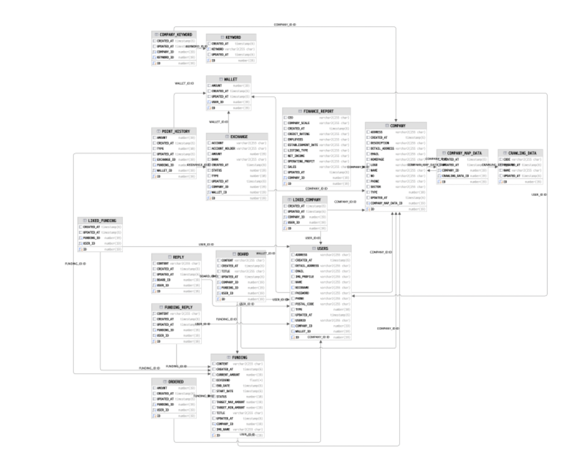
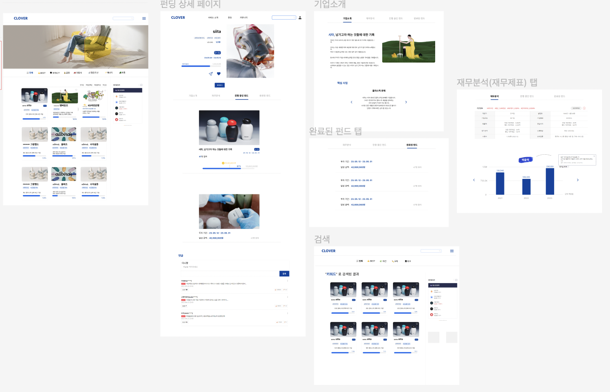
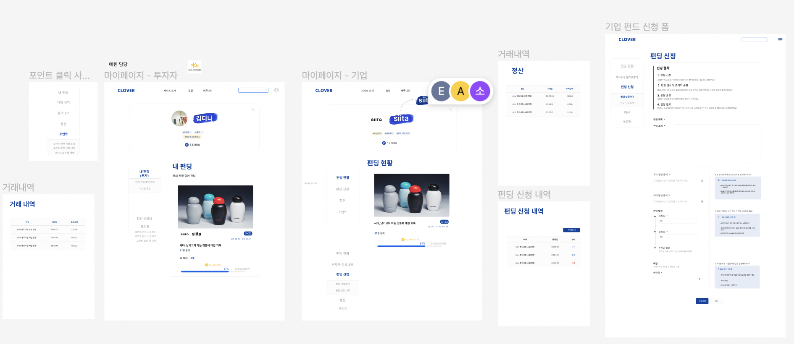
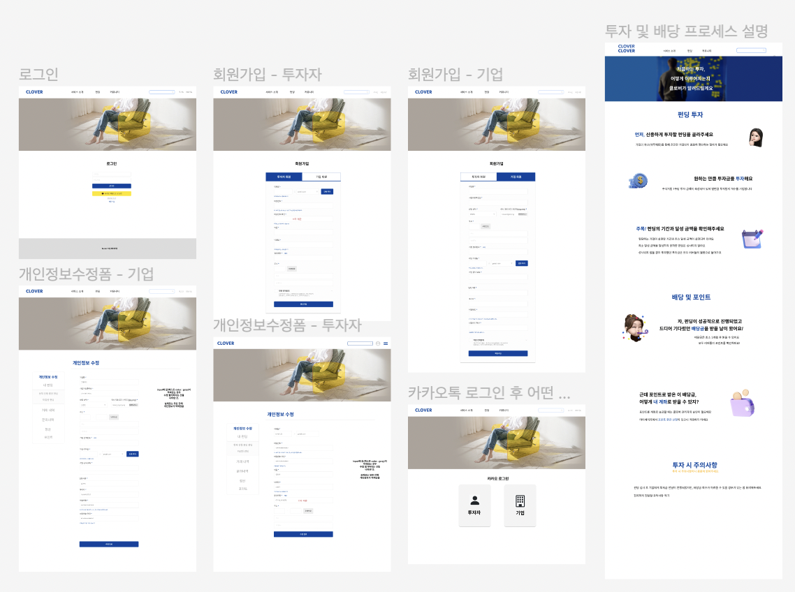
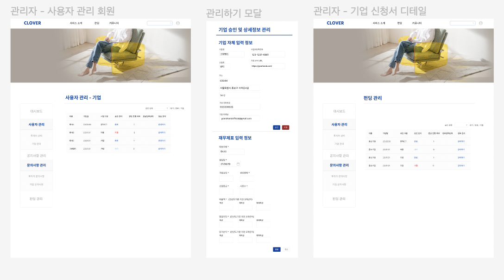
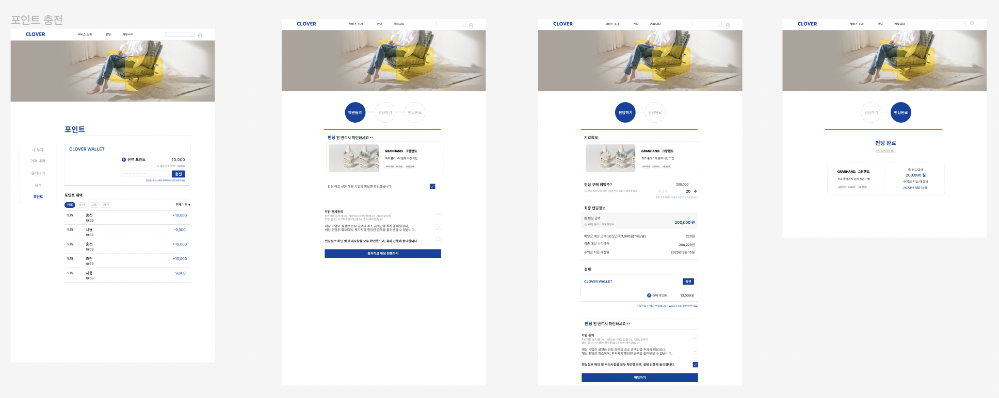

# CLOVER

초보 투자자를 위한 투자형 크라우드펀딩 서비스
 
 

## ✏️ 기획취지
 
  
 
투자를 배우고자 하는 초보 투자자와 ESG 사업을 진행하는 스타트업을 위해 만들어졌습니다. 
설문조사를 시행한 결과, 20대 초보 투자자들은 <strong>어려운 투자 용어, 쉽게 파악할 수 없는 기업 정보 </strong>등 투자에 대한 진입장벽을 느끼고 있습니다. 뜻깊은 소비 행동이 늘어나고 있는 만큼 <strong>선행 사업을 진행하는 ESG 기업</strong>에 투자를 원하고 있습니다.
 
 
  
 
기업은 자금조달에 대한 접근성이 높은 크라우드 펀딩을 통해 <strong>사업 자금을 충당하여</strong> 사회 공헌을 위한 ESG 사업에 더욱 활발하게 기여할 수 있습니다.  
사용자의 니즈를 충족하기 위해 투자를 배우고자 하는 초보 투자자와 자금 조달을 필요로 하는 ESG 기업을 이어주는 다리와 같은 역할을 수행하고자 서비스를 고안하였습니다.
 
 

## 🗓 개발 기간
 
  
 

<strong> 1️⃣ 기획: </strong> : 05.03 - 05.09  
<strong> 2️⃣ 분석 및 설계: </strong> : 05.06 - 05.16  
<strong> 3️⃣ 메인 서비스 구축: </strong> : 05.14 - 05.29  
<strong> 4️⃣ 서비스 점검: </strong> : 05.29 - 05.30  

 
 

## 🔧 기술 스택
 

 
 

## 🔧 DB모델링 (ERD)
 
 

 
 

## 🔧 화면설계 
 

 

 

 

 

 
 

## 팀원